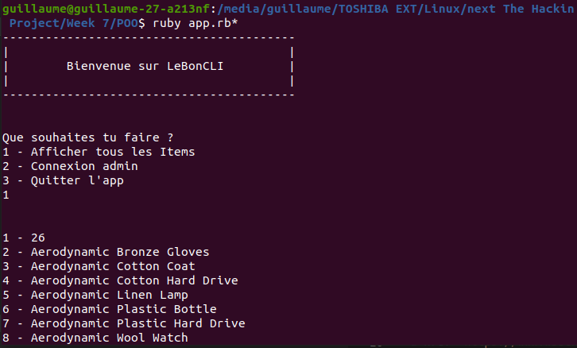

<h1 align="center">
  <br>
  <a href="https://www.guillaumereygner.fr/"></a>
  <br>
LebonCLI<br>
</h1>
<h4 align="center">Exercice final POO pour The Hacking Project</h4>
<br>



## Utilisation 🌐

Pour utiliser le site utilisez la commande suivante : 
```ruby app.rb```

## Technologies utilisées ⚙️

<p align="left">Pour ce programme les technologies suivantes ont été utilisé : <br>
<a href="https://www.ruby-lang.org/en/" target="_blank" rel="noreferrer">  </a>
<br>
<br>

## Crédit 🔗
[Guillaume Reygner](https://github.com/guillaume-rygn)